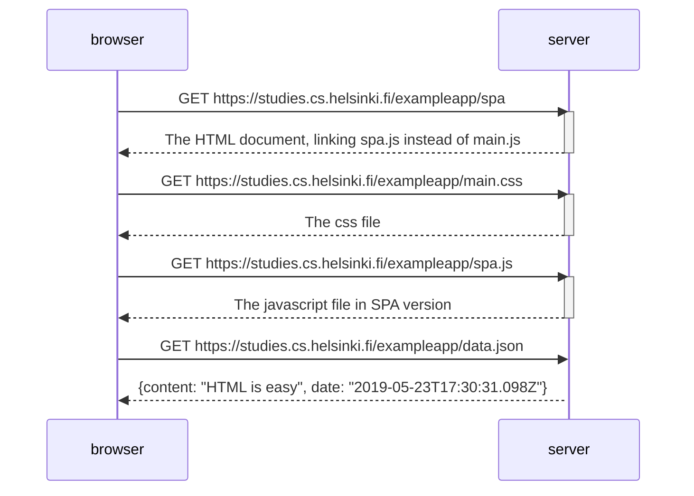

```mermaid
sequenceDiagram
    participant browser
    participant server
browser->>server: GET https://studies.cs.helsinki.fi/exampleapp/spa
activate server
server-->>browser: The HTML document, linking spa.js instead of main.js
deactivate server
browser->> server: GET https://studies.cs.helsinki.fi/exampleapp/main.css
activate server
server-->>browser: The css file
deactivate server
browser->>server: GET https://studies.cs.helsinki.fi/exampleapp/spa.js
activate server
server-->>browser: The javascript file in SPA version
deactivate server
browser->>server: GET https://studies.cs.helsinki.fi/exampleapp/data.json
activate server
server-->>browser: {content: "HTML is easy", date: "2019-05-23T17:30:31.098Z"}
```
