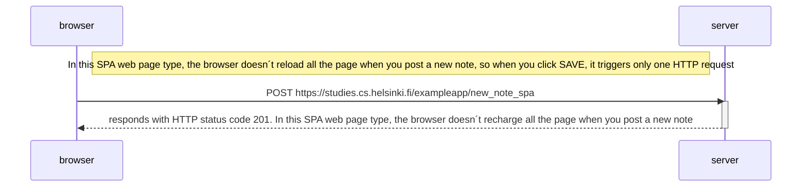

```mermaid
sequenceDiagram
  participant browser
  participant server
Note right of browser: In this SPA web page type, the browser doesn´t reload all the page when you post a new note, so when you click SAVE, it triggers only one HTTP request
browser->>server: POST https://studies.cs.helsinki.fi/exampleapp/new_note_spa
activate server
server-->>browser: responds with HTTP status code 201. In this SPA web page type, the browser doesn´t recharge all the page when you post a new note
deactivate server
```
